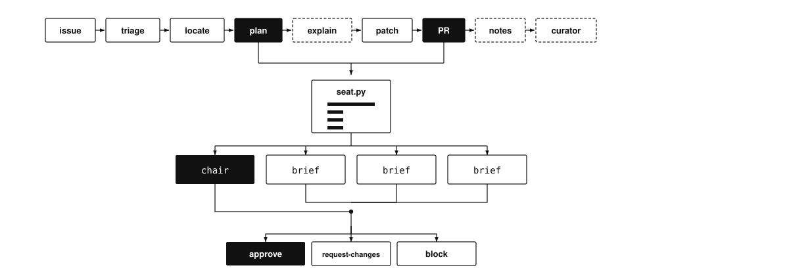

# swift-compiler-skills

<p align="center">
  
</p>

Agent skills for finding, triaging, and fixing bugs in the Swift compiler
([`swiftlang/swift`](https://github.com/swiftlang/swift)).

Coding agents fail this work in repeatable ways. They patch Sema for a
SILGen bug. They lose hours to a stale build tree. They put the test in
the wrong directory, so CI disagrees with their laptop. Then the chat
ends and none of that is written down.

This repo is the counter. Skills are a **directory**: lean `SKILL.md`, a
knowledge base, and scripts, loaded on demand. One skill walks a single
issue all the way through. The others are specialists it calls. After a
fix (or a failure) the curator applies **one bounded edit**, accepted
only behind replay, counterexample, or execution gates. Historical
issues name files to open. They do not decide the patch for a different
issue.

How edits are accepted, and which issue IDs may be harvested:
[`docs/eval-protocol.md`](docs/eval-protocol.md).

## Skills

| Skill | Use when |
| --- | --- |
| [`swift-compiler-fix-loop/`](swift-compiler-fix-loop/SKILL.md) | End-to-end fix of one issue: triage → reproduce → **plan panel** → patch → tests → **PR panel** → durable case notes. The default entry point. |
| [`swift-issue-triage/`](swift-issue-triage/SKILL.md) | Classify an issue into pipeline stage + failure family from *this* issue's stack/repro *before* touching code. |
| [`swift-local-build-test/`](swift-local-build-test/SKILL.md) | Build targets, run lit tests, manage worktrees; the verified environment contract for this machine. |
| [`swift-expert-panel/`](swift-expert-panel/SKILL.md) | Required after the written plan (before compiler edits) and again on the diff (before marking a PR ready). Also on demand for a plan, PR, or diff. |
| [`swift-knowledge-curator/`](swift-knowledge-curator/SKILL.md) | After fixes (or failures): one bounded, validation-gated edit to these files. |

Shared knowledge base (loaded on demand):

- [`knowledge-base/pipeline-map.md`](knowledge-base/pipeline-map.md) —
  stage-identification table + cross-stage heuristics
- [`knowledge-base/stage-playbooks/`](knowledge-base/stage-playbooks/) —
  parse, sema, silgen, sil-optimization, irgen-runtime, tooling-ide,
  cross-cutting
- [`knowledge-base/regression-test-cookbook.md`](knowledge-base/regression-test-cookbook.md)
  — per-layer RUN lines and test placement, extracted from the real suite
- [`knowledge-base/resolved-issue-patterns.md`](knowledge-base/resolved-issue-patterns.md)
  — search families A1–A10 (files to open, not patch recipes)
- [`knowledge-base/expert-panel/`](knowledge-base/expert-panel/) —
  domain review briefs, seating table, evolution gate, chair protocol,
  scorecard (supplementary to issue-mined playbooks)
- [`knowledge-base/sibling-repos.md`](knowledge-base/sibling-repos.md) —
  when the bug is llvm / swift-driver / swift-syntax / sourcekit-lsp

What changed, and which edits helped or hurt:

- [`optimization/edit-log.md`](optimization/edit-log.md) — append-only journal
- [`optimization/deltas.md`](optimization/deltas.md) — one helpful/harmful bullet per accepted epoch
- [`optimization/splits/`](optimization/splits/) — train / selection / test IDs

## Install

Symlink each skill into your agent's skill directory:

```bash
REPO=~/.agents/skills   # or ~/.claude/skills, per your agent
for s in swift-compiler-fix-loop swift-issue-triage swift-local-build-test swift-expert-panel swift-knowledge-curator; do
  ln -sfn "$PWD/$s" "$REPO/$s"
done
```

Machine checkouts and build trees live in one file:
[`swift-local-build-test/references/paths.json`](swift-local-build-test/references/paths.json).
Edit that file if you relocate; do not scatter new absolute paths.

## Reading Order For A Fix Task

1. `swift-compiler-fix-loop/SKILL.md`
2. `swift-issue-triage/SKILL.md` — run the triage procedure before any fix
3. `knowledge-base/<playbook for the triaged stage>`
4. `swift-local-build-test/SKILL.md` — for every build/test command
5. `swift-expert-panel/SKILL.md` — **plan review after step 4, PR review after step 8**
6. On completion (success *or* failure): `swift-knowledge-curator/SKILL.md`

## Expert panel: when and how

The panel is **required** in the fix loop, not optional polish. Playbooks
say where to look; the panel says whether the plan or patch is acceptable
in the domains it touches.

**When (required)**

| Gate | When | Artifact | Do not proceed until |
| --- | --- | --- | --- |
| Plan review | After the bug is explained (fix-loop step 4), **before any compiler source edit** | Written invariant, broken assumption, path, intended change, likely files | Chair `approve` |
| PR review | After local tests pass and the patch is prepared (fix-loop step 8), **before marking the PR ready** | Diff + PR description + changed files | Chair `approve` |

**When (on demand):** the user asks to review a plan, diff, PR URL, or
case file — same procedure.

**Skip only** if the change is comment-only, docs-only, or
test-expectation-only **and** does not encode a language rule. If
unsure, sit.

**How**

1. Seat (do not pick domains by hand):

```bash
python3 swift-expert-panel/scripts/seat.py --stage <triage-stage> \
  --text-file <plan-or-pr-body> -- <changed files relative to the swift checkout>
```

2. Independent ballots: one read-only agent per `seated` domain. Each
   loads only `knowledge-base/expert-panel/domains/<id>.md` plus
   `evolution-gate.md` and the artifact. Out-of-charter seats **abstain**.
3. Chair: one more agent, the script's `chair` domain. It issues the
   only verdict the loop obeys (`chair-protocol.md`).
4. Obey the verdict:
   - `approve` — continue
   - `request-changes` — apply `must_address`, then **re-sit**
   - `block` — do not implement / do not mark the PR ready
5. Record seating JSON, ballots, and chair verdict in the case file
   under `## Expert panel`.

On Grok, after `seat.py`: `/swift-expert-panel` or
`/workflow swift-expert-panel` with `{kind, chair, seated, artifact, files}`.
On other hosts, follow `swift-expert-panel/SKILL.md` with parallel
subagents.

Full procedure: [`swift-expert-panel/SKILL.md`](swift-expert-panel/SKILL.md).

## Design Principles

How the suite is allowed to change:

1. **Entry skills stay lean** (<~120 rendered lines); depth lives in the
   knowledge base and is loaded on demand.
2. **Execution gate**: a build/test command may only be recorded as fact
   after it has run successfully on the target machine.
3. **Replay + counterexample gates**: new triage/pattern claims must re-route
   already-solved cases correctly and explain at least one case the current
   docs would have misrouted.
4. **Bounded edits**: ≤3 substantive rule changes and ≤30 knowledge-
   base lines per curation epoch; rejected proposals are journaled, not lost.
5. **Failure data is kept**: misroutes, broken commands, and
   environment traps are recorded in the same epoch they are observed.
6. **Never weaken a verifier to silence an assert** — applies to both the
   compiler and this suite's gates.
7. **This issue is the only evidence of a correct patch.** Similar issues,
   archetypes, case files, and wiki lessons may name files. They must not
   be copied as the fix. If this issue already has PRs, read those.

## What we have actually checked

Highlights from `docs/validation.md`; full detail in the edit journal:

- Epoch 9: flag ladder is required when the stack does not settle stage;
  search-family maps are issue+stage only; harvested plans are not the
  diagnosis.
- Epoch 8: historical issues no longer prescribe patches.
- Environment contract derived empirically: swift `main` pairs with llvm
  `stable/21.x` (authoritative source: swift's own `update-checkout-config.json`),
  plus verified signatures for six distinct failure modes.
- Post-migration toolchain validated: `test/DebugInfo` 336/337 passed
  (single pre-existing environmental failure), smoke tests across
  Constraints/SILGen pass, and a real in-flight bug fix (SIL debug-value
  type chains) was rebased, completed under lit feedback, and green.
- Seating replay: 15/15 on the `D_tr` scorecard, 10/10 on `D_sel`. That
  is chair-match, not a with-skill vs no-skill result. The `D_test` run
  has not happened.

## Docs

- [`docs/design.md`](docs/design.md) — architecture
- [`docs/eval-protocol.md`](docs/eval-protocol.md) — how edits are accepted; train / selection / test splits
- [`docs/validation.md`](docs/validation.md) — what was verified, and how
